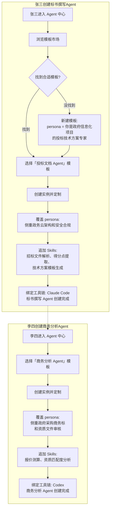
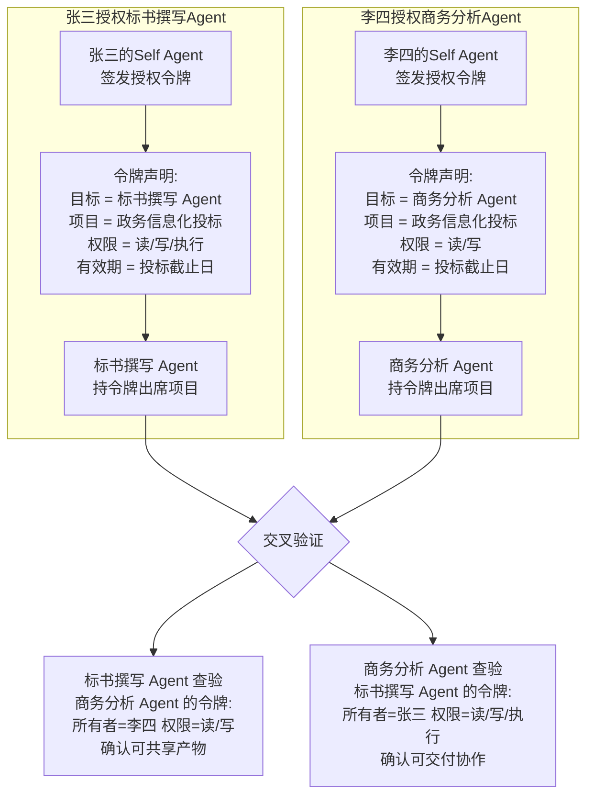
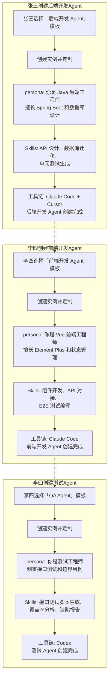
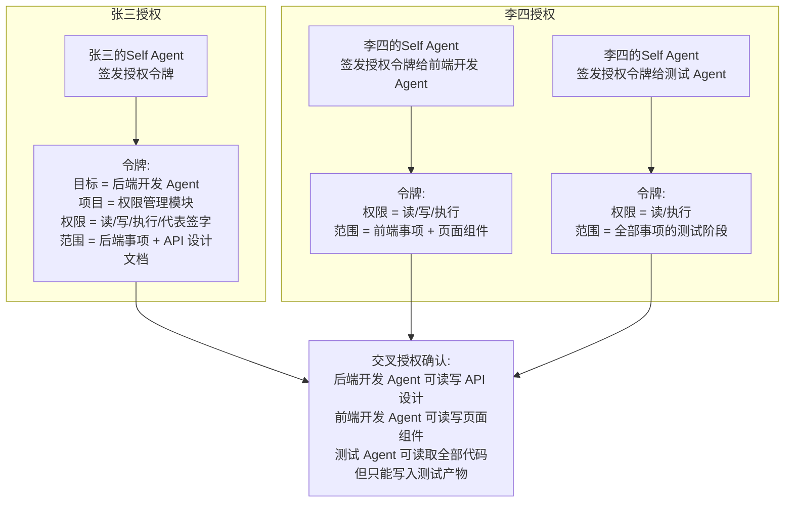

# 人与 Agent 协作平台功能清单

## 产品愿景

- 工作流围着你的团队转，别反过来。
- 人决定哪些决策重要。
- 人和 Agent 在同一个协作空间里以统一的身份和规则并肩工作。


## 定位

**Agent-native 的协作编排平台**。PaaS 形态。平台的基本实体是 Agent，每个用户由自己的Self Agent 参与协作，Specialized Agent 作为独立一等公民直接与其他 Agent 交互。人作为 Agent 的所有者和最终决策者，在平台上直接查看产物、管理进度、做门控决策。

**身份统一原则**。系统内所有参与者统称为 Agent，用户即 Agent，Agent 即参与者。人通过自己的Self Agent 出现在协作空间中，所有动作以 Agent 名义记录。协作视角上看不到"人"和"机器"的区别，只有不同所有者的 Agent 之间的协作。底层执行层仍保留人操作和 Agent 操作的区分，用于审计、权限、责任归属的合规要求。

**平台与配置资产的边界**。平台提供通用能力，不绑定任何具体场景。所有场景化方案都是配置出来的资产，分三层来源：平台预置（选 1 到 2 个高价值场景做深度示范，初期是投标和软件开发）、Workspace 自定义、用户自定义。平台持续补充预置模板，但绝不替代用户在自己场景下的配置能力。

**核心设计**：统一 Agent 身份 + 阶段模板驱动的结构化工作流 + 门控与回退机制 + 协作 Agent。

**PaaS 形态**。平台是协作引擎，不是某个具体场景的产品。底层抽象通用：Agent 身份、事项、阶段模板、门控、A2A 协议、产物协作、Skills 兼容。上层所有场景化方案（投标、软件开发、设计、文档协作、销售协作等）都是配置出来的资产，平台本身不绑定任何场景。同一个平台可以支撑工程团队、业务团队、设计团队的不同工作模式，差别只在于挂载的阶段模板和 Specialized Agent 模板不同。

---

## 核心概念定义

### Agent
平台内所有参与协作的原子实体。每个 Agent 有唯一标识、类型、能力描述、所有者、授权范围。

**身份统一原则**：平台内所有参与者统称为 Agent。用户登录后即以自己的Self Agent 身份参与协作，所有动作（评论、改状态、做门控决策、上传文件）以 Agent 名义记录。协作视角上看不到"人"和"机器"的区别，只有不同所有者的 Agent 之间的协作。

**执行分层**：业务身份统一的同时，底层执行层仍区分人类操作和 Agent 操作。每次动作记录两个信息：业务身份（哪个 Agent 名义）和执行主体。执行主体分三类：人直接操作（含 Self Agent 代为执行，Self Agent 的所有动作在审计上视同人亲自操作）/ Specialized Agent 自主执行 / 第三方工具代为执行。执行主体用于审计、权限判定、责任归属。这一分层对金融、医疗、法律等强合规场景的审计需求是必需的。

**类型（业务层）：**
- Self Agent（Representative Agent）：与用户一对一绑定，是用户的数字身份、信任根、默认对话入口和调度中枢。在对话场景下是对话默认 Agent，承载用户的所有对话指令；具备调度其他 Agent 的能力，按用户意图调用 Specialized Agent 协作（典型路径：用户在对话中 @ 某 Specialized Agent 时，由 Self Agent 整理上下文与 prompt 后转发，被调用 Agent 的回复回到原对话窗口）。在事项场景下以 Self Agent 名义署名用户的直接操作。Self Agent 是用户所有协作行为的总入口和默认署名方。
- Specialized Agent：执行特定任务的 Agent，如编码 Agent、文档 Agent、分析 Agent。在对话场景下作为 Self Agent 的调度对象，被 @ 时接收 Self Agent 转发的结构化 prompt；在事项场景下作为负责人独立推进事项。

**Self Agent 的调度语义**：所有"用户意图驱动多 Agent 协作"的场景，统一由 Self Agent 居中调度。Self Agent 持有用户级长期上下文（对话历史、偏好、工作习惯），在转发给 Specialized Agent 前自动完成上下文裁剪、prompt 构造、Skills 与工具链匹配、授权令牌附带等准备工作；Specialized Agent 执行完成后将结果回到 Self Agent，由 Self Agent 决定是直接呈现给用户、追加自己的判断、还是继续调度其他 Agent。Specialized Agent 不直接对用户暴露，所有对外交互通过 Self Agent。

**底层运作模式：**
两类 Agent 的实际执行均可由第三方 Agent 驱动（Claude Code、Codex、Cursor 等）。「第三方」描述技术提供方来源（Anthropic、OpenAI 等），属于 Agent 的底层运作模式，与业务身份正交，统一通过第五层编程工具对接接入。

**部署位置：**
Self Agent 和 Specialized Agent 均支持三种部署位置，由用户或 Workspace 管理员按场景选择。

- **本地优先**：Agent 跑在用户本地机器的守护进程内，API 密钥、代码目录、本地凭据全部留在本地，平台只接收事件和上报的执行日志。适合涉及敏感数据、强数据主权诉求、需要访问本地文件系统的场景。
- **云端常驻**：Agent 跑在平台提供的容器内，7×24 持续运行，独立于用户是否在线。用户授权后由平台托管刷新令牌与运行时凭据。适合自动化任务（cron 触发）、跨用户协作、跨时区长周期任务、用户离线时仍需持续推进的工作。Self Agent 云端常驻时，可在用户离线状态下代表用户接收通知、执行自动化任务、回应被 @ 的对话，但自主决策范围受用户预先配置的策略约束。
- **混合**：本地为主、云端接管关键场景。常见模式是 Self Agent 本地优先（信任根不上云），Specialized Agent 按需云端常驻；或同一 Agent 平时本地跑，定时任务时段切到云端。

部署位置的选择不影响 Agent 的业务身份和调度语义，只影响执行环境。所有部署位置共享同一套授权令牌校验、审计日志和事件流。

**Self Agent 部署位置切换约束**。Self Agent 持有用户级长期上下文，部署位置切换会导致上下文不迁移。允许切换但必须在切换前显式确认"将丢失原长期上下文（对话历史、偏好、工作习惯）"。Specialized Agent 不受此约束，可自由切换部署位置，切换后从空上下文起步。

### User（人）
Agent 的所有者。人在平台上的存在形式是其Self Agent。人登录平台后以Self Agent 名义执行所有动作。Self Agent 的所有动作在审计上视同人亲自操作，业务身份为该 Self Agent，执行主体归到"人直接操作"。底层执行层的"人直接操作"标记用于审计追溯，区分哪些动作是人亲自做的（含 Self Agent 代为执行）、哪些是 Specialized Agent 自主执行的。这一区分对金融、医疗、法律等强合规场景的审计需求是必需的。

### Workspace（工作区）
独立协作空间，所有数据隔离。Workspace 内有成员（User）、Agent、项目、模板。

### Project（项目）
一个工作目标的容器，包含多个事项、成员、Agent、阶段模板实例。每个项目与一个 Git 仓库一对一绑定，仓库内的所有文件构成项目级的共享文件命名空间。项目内的事项通过引用方式使用文件，而非独占文件。

### Conversation（对话）
平台内与事项并列的轻量交互单元，是用户与 Self Agent 的常驻交互窗口。每个对话默认绑定用户的 Self Agent，用户的所有对话指令先由 Self Agent 接收。当用户在对话中 @ 任一 Specialized Agent 时，由 Self Agent 整理当前对话上下文、相关事项信息、用户意图，构造结构化 prompt 后转发给被 @ 的 Agent，该 Agent 的回复回到原对话窗口，由 Self Agent 决定如何呈现给用户。

**对话与事项的边界**。对话适用于无需结构化阶段流转的快速问答、临时任务、咨询建议、Agent 调度试验；事项适用于需要阶段、门控、产物沉淀、跨 Agent 长期协作的工作。用户可在对话中主动选择"转为事项"，将当前对话上下文打包为新事项的初始输入，进入结构化流程；事项内的协作空间消息也可被 Self Agent 引用回对话作为参考。

**Self Agent 调度的实现**。对话中的 @ 调度本质是 Self Agent 居中转发：Self Agent 持有用户级长期上下文（跨对话历史、偏好、工作习惯），转发前自动完成上下文裁剪、prompt 构造、Skills 与工具链匹配、授权令牌附带；被调用的 Specialized Agent 不直接暴露给用户，所有交互通过 Self Agent 中转。多个 Specialized Agent 可在同一次 @ 中被同时调度，由 Self Agent 编排结果汇总。

**调度路径的双入口**。@ 触发的协作按入口分两条路径，分别覆盖对话和事项两个协作单元：
- 对话入口：用户在对话中 @ Specialized Agent，走 Self Agent 居中转发。Self Agent 整理 prompt 后通过 A2A 协议传递给被 @ Agent，结果回流由 Self Agent 决定呈现方式。被调用的 Specialized Agent 不直接暴露给用户。
- 事项入口：Agent 在事项协作空间 @ 其他 Agent（同类或跨所有者），平台事件路由捕获"Agent 被 @"事件后直接唤醒被 @ Agent。被唤醒 Agent 读取事项上下文执行，结果回到原协作空间。事项入口不经过 Self Agent 中转。

两条路径都遵循 A2A 协议层和授权令牌校验，差异在于是否经 Self Agent 居中编排。对话入口面向轻量、临时、用户意图驱动的协作；事项入口面向事项推进过程中 Agent 之间的工作衔接。

### 事项 (Item)
核心工作单位，是平台内唯一的原子协作单元。每个事项有标题、描述、负责人（Agent）、状态、标签、评论。

事项不拥有专属文件，可引用所属项目 Git 仓库内的任意文件作为输入或产物。具体引用哪些文件，由事项绑定的阶段模板声明的输入/输出路径决定。同一文件可被同一项目内多个事项同时引用，文件的真实内容和版本完全由 Git 管理，平台只做 HEAD 工作树的镜像用于渲染展示。

事项根据所绑定的工作模板，呈现两种行为：
- **简单任务（默认模板）**：走四态状态机（todo / in_progress / in_review / done），适合 bug、想法、快速修复等简单工作。事项创建时默认选中，始终可选。`in_review` 是 Agent 宣告完成后的缓冲态，由决策者（人或被授权 Agent）确认通过后才能进入 `done`，也可打回 `in_progress`。
- **结构化模板**：走阶段驱动工作流，适合投标、Feature 开发、文档撰写等复杂工作。

事项创建时默认绑定简单任务模板，用户可主动切换为项目允许的任一结构化模板。项目级别配置可用模板集合，事项只能从项目允许的模板中选择。事项可在简单任务与结构化模板之间双向切换，切换时保留协作历史和已生成产物。

### Specialized Agent Template（SAT）
Specialized Agent 的配置模板，包含 persona（系统提示词）、默认工具链、默认 Skills 清单。支持三层来源：平台预置（只读）、Workspace 自定义、用户自定义。Skills 是独立的能力模块，独立于模板管理，详见下方 Skills 定义。用户基于模板创建 Specialized Agent 实例，可覆盖 persona、追加 Skills、调整工具链。模板更新不自动应用到已存在的实例。

### Skills
平台的能力模块化抽象。一个 Skill 封装一类具体能力（如代码评审、API 文档生成、招标文件解析），可被任意 SAT 和阶段模板引用，与 SAT 解耦、独立分发。

**来源与标准**：原生兼容 Anthropic Agent Skills 开放标准，标准 Skills 可直接接入；非标准 Skills 通过适配层包装后接入。三层来源与 SAT 一致：平台预置（只读）、Workspace 自定义、用户自定义。独立版本管理、独立分发。

**双重声明机制**：
- SAT 声明 Agent 默认携带的 Skills 清单，实例化时可追加。
- 阶段模板声明该阶段执行所需的 Skills 清单，作为执行前置条件。

事项进入某阶段时，平台合并 SAT 持有的 Skills 与阶段模板声明的所需 Skills，传递给本地 Agent。SAT 缺少阶段所需 Skill 时，平台告警，由 Owner 决定追加 Skill、切换负责 Agent 或调整模板。

**生命周期**：Skills 模板更新不自动应用到已实例化的 Agent，与 SAT 一致。Owner 可主动升级实例的 Skills 版本。

### Stage Template（阶段模板）
按事项类型预定义的阶段结构，包含阶段列表、每个阶段的状态集合、输入/输出文件路径声明、所需 Skills 清单、默认门控配置。

### Gate（门控）
挂在状态转换上的可选约束。未被门控拦截的转换由负责 Agent 自主推进；被拦截的转换等待决策者（人或其他被授权的 Agent）给出结构化决策。

### Artifact（产物）
事项各阶段的输出文件，通过 Git 传递，在平台上渲染展示。支持版本对比、协作讨论。

### Authorization Token（授权令牌）
Self Agent 向 Specialized Agent 签发的范围授权凭证，声明该 Agent 能以什么权限参与哪些项目、执行哪些操作。

### 标签 (Label)
附加在事项上的分类标记，用于筛选、分组和视图组织。标签分两级：系统标签（Workspace 级通用，所有项目共享）和项目标签（单个 Project 自定义，仅在该项目内可用）。标签由人创建和管理，Agent 可以读取标签信息并按标签过滤事项。

### A2A 协议 (Agent-to-Agent Protocol)
Agent 之间直接通信的标准协议。平台采用 Google 主导、2025 年 4 月发布、随后捐赠给 Linux Foundation 的 A2A 协议作为原生标准。原生支持 A2A 协议的 Agent 可直接交换上下文和协作指令；不支持 A2A 的 Agent 通过平台绑定的协议适配器进行转换，由平台代理其通信。

**Agent 类型通信矩阵**。A2A 协议按 Agent 类型约束通信范围：
- Specialized Agent ↔ Specialized Agent：默认允许，受双方授权令牌范围约束。
- Self Agent ↔ Self Agent（跨用户）：允许，用于跨用户协作触达。
- Self Agent ↔ 自己的 Specialized Agent：允许，作为 Self Agent 调度语义的底层通道。
- Self Agent ↔ 别人的 Specialized Agent：需对方 Self Agent 签发授权令牌。

**A2A 与 Self Agent 调度的关系**。A2A 是 Agent 间通信的协议层，Self Agent 调度是对话场景下的居中编排语义。对话入口的协作走 Self Agent 居中转发（用户 @ → Self Agent 整理 prompt → 被调用 Agent 执行），事项入口的 Agent 间协作走 A2A 直连（事件路由直接驱动被 @ Agent）。两者不冲突，分别覆盖不同的协作入口。

### Connector（连接器）
平台与外部系统之间的标准适配器抽象，作为集成层的一等公民。每个 Connector 封装一个外部系统（GitHub、GitLab、飞书、Slack、Jira、Webhook、企业内部 API 等）的接入细节，对外暴露统一的触发器和动作模型。

**触发器与动作**。触发器（Trigger）描述外部事件如何进入平台：GitHub PR 创建、飞书群消息、Jira 状态变更、定时 Webhook 等，触发后转化为平台事件，进入事件路由或唤醒云端 Agent。动作（Action）描述平台如何调用外部系统：创建 PR、推送 IM 消息、更新 Jira issue、调用企业内部 API 等，由 Agent 或自动化任务通过平台 CLI 发起。一个 Connector 可同时声明触发器和动作，实现双向同步。

**凭据管理**。Connector 自管外部系统的访问凭据（OAuth Token、API Key、Webhook Secret 等），加密存储于 Workspace 级凭据仓库，与 Agent 授权令牌解耦。凭据轮换、过期告警、紧急撤销由 Connector 自己负责。

**来源与分发**。Connector 支持三层来源，与 SAT 一致：平台预置（覆盖主流 Git 托管、IM、项目管理、文档协作等系统）、Workspace 自定义（企业内部系统对接）、用户自定义（个人小众工具接入）。Workspace 管理员配置可用 Connector 范围，项目和 Agent 按需挂载。

**统一接入原则**。所有外部系统集成都走 Connector 抽象，平台不再为单个外部系统硬编码集成路径。Connector 之间共享同一套事件格式、错误模型、重试与降级策略，便于编排跨系统工作流（如 GitHub PR 合并触发飞书通知唤醒 Agent 跑代码扫描）。

### 平台 CLI（CoMach CLI）
平台级的统一命令行接入层，与 Web UI、开放 API 并列为平台的三种接入方式。CLI 对 Web UI 的所有能力做完整镜像，覆盖全部平台域：事项（item）、Agent（agent）、对话（conversation）、项目（project）、Workspace（workspace）、阶段模板（template）、标签（label）、自动化任务（automation）、门控（gate）、搜索（search）、通知（notification）等。Web UI 能做的所有操作，CLI 均可完成。

**全平台 CLI 化原则**。每上线一个 Web UI 功能，必须同步提供对应 CLI 子命令；反之 CLI 命令族与 Web UI 共享同一套能力注册表，不存在"只有 UI 能做、CLI 做不了"或"只有 CLI 能做、UI 做不了"的能力（仅渲染类、可视化编辑类等天然不适合命令行的形态除外）。平台维护统一的命令族清单和能力描述，作为人、Agent、第三方集成的共同入口。

**人对称**。人可在终端直接调用 CLI 完成事项创建、状态转移、Agent 配置、对话发起、自动化任务编排等所有操作，等价于在 Web UI 上点击对应功能。脚本化场景下 CLI 比 Web UI 更高效。

**Agent 入口**。Agent 在本地执行时同样调用平台 CLI 操作平台能力，复用与人类用户一致的命令族与参数 schema，不必为 Agent 单独设计协议。所有 CLI 调用都需要鉴权：本地执行经本地守护进程鉴权，云端执行经云端容器内嵌的等价鉴权模块（持有平台为该 Agent 实例签发的临时凭据）。鉴权后统一进入平台 API，执行主体（人 / Agent）记入审计日志。

**调用形态**。CLI 同时支持交互式参数和 JSON 输入输出，便于人在终端使用、Agent 在脚本中编排、第三方系统通过子进程集成。CLI 跨平台分发（Windows / macOS / Linux），随桌面应用安装或独立安装。

---

## 一、Agent 身份与授权协议层

| 功能 | 说明 |
|------|------|
| Agent 注册 | 创建 Agent 时声明类型、名称、能力描述、所属所有者。系统分配唯一标识。 |
| Self Agent 绑定 | 用户首次加入 Workspace 时自动生成 Self Agent，与用户身份一对一绑定，不可删除。Self Agent 自动成为用户的默认对话 Agent 和调度中枢，承载所有对话指令和 Specialized Agent 调度语义。 |
| Self Agent 调度能力 | Self Agent 持有用户级长期上下文，可在对话中按用户意图或 @ 指令调用任一 Specialized Agent。调度时自动完成上下文裁剪、prompt 构造、Skills 与工具链匹配、授权令牌附带；被调用 Agent 的回复回到原对话，由 Self Agent 决定呈现或继续编排。Specialized Agent 不直接暴露给用户。 |
| Specialized Agent 模板管理 | 创建、修改、版本管理、归档 Specialized Agent 模板。模板包含 persona（系统提示词）、默认工具链、默认 Skills 清单。支持三层来源：平台预置（只读）、Workspace 自定义、用户自定义。Skills 是独立模块，详见 Skills 概念定义。 |
| Specialized Agent 模板市场 | 浏览平台预置、Workspace 自定义和用户公开的模板；支持 fork、版本对比、按能力标签和 Skills 组合搜索。 |
| Specialized Agent 创建 | 基于 Specialized Agent 模板创建实例，可覆盖 persona、追加 Skills、调整工具链。模板更新不自动应用到已存在的实例。 |
| Agent 部署位置配置 | 为 Self Agent 和 Specialized Agent 配置部署位置：本地优先、云端常驻、混合。云端常驻需声明运行时凭据托管策略、自主决策范围（针对 Self Agent）、唤醒机制（cron / 事件触发 / 对话 @）。Workspace 级配置可约束部署位置允许范围（如金融场景强制本地优先、办公场景允许云端常驻）。 |
| 云端 Agent 凭据托管 | 云端常驻 Agent 的运行时凭据由平台加密托管，支持刷新令牌轮换、过期告警、紧急撤销。用户可随时查看云端 Agent 持有的凭据清单并单条撤销。 |
| 授权令牌签发 | Self Agent 向 Specialized Agent 签发带范围的令牌，声明可读项目、可改状态、可代表签字的边界。 |
| 授权范围配置 | 按 Workspace、Project、事项维度配置权限；支持读、写、执行、代表签字四级权限。 |
| 身份验证与出席 | Agent 参与事项时出示凭证，协作方可查验其授权范围和所有者。 |
| 代理召回与撤销 | 所有者随时可召回自己的 Agent，中断其正在进行的协作，撤销其未使用的授权令牌。 |
| Agent 可见性管理 | Agent 可设置为 Workspace 内可见、Project 内可见、或私有。 |
| Agent 能力发现 | 平台提供 Agent 目录，可按能力标签搜索和浏览 Workspace 内的 Agent。发现对象为模板实例化后的 Agent，可按模板来源、能力标签、Skills 组合、所有者搜索。 |
| 授权审计日志 | 记录所有授权、委托、召回操作，所有者和管理员可查阅。 |
| Agent 行为红线 | 内置危险操作拦截清单：删除主分支、强制推送、调用付费 API、外发数据到 Workspace 外、读取敏感目录（密钥、凭据、生产数据库连接串）、批量删除文件、修改其他 Agent 的授权令牌等。Specialized Agent 执行前过拦截器，命中红线时暂停执行并通知所有者人工确认。拦截清单可在 Workspace 级别扩展。 |

---

## 二、人在平台上的在场层

| 功能 | 说明 |
|------|------|
| 个人控制视图 | 人登录后看到自己和自己的所有 Agent 的状态、授权、正在参与的事项。 |
| 事项看板（默认落地页） | 用户登录后默认进入事项看板，按状态或阶段分列展示当前项目内所有事项（类 Trello/Jira 形态）。支持拖拽改状态、按负责人/标签/截止日期/周期筛选、点击进入事项详情、跨项目切换。看板列由事项模板的状态集合决定（简单任务四态、结构化模板按当前所处阶段聚合）。看板上人能做的所有操作（新增事项、转移事项、改负责人、改状态），Agent 通过 Agent CLI 同样可执行，看板实时反映双方变更。 |
| 项目全景视图 | 看所有事项的状态、所处阶段、负责人、阻塞点、产物概览。 |
| 人的直接动作 | 发评论、改事项状态、上传文件、做门控决策、添加标记。以人的名义记录。 |
| 产物查看 | 在平台上渲染查看产物内容（Markdown、PDF、图片、代码 diff），不依赖本地环境。 |
| 产物版本对比 | 查看同一文件在不同阶段或不同版本的差异。 |
| 标记管理 | 为事项添加标签、优先级、风险标记。系统标签全项目通用，每个项目可额外定义自己的项目标签。人可手动增删改标签。 |
| Agent 附身观察 | 人可临时切换到自己的某个 Agent 视角，查看其当前持有的上下文、记忆、执行历史。 |
| 通知中心 | 门控待决策、Agent 被召回、事项超期、产物被评论等事件的通知聚合。 |
| 通知渠道配置 | 通用 IM 抽象层，三层结构：事件 → 通知模板 → 渠道。支持主流 IM（飞书、Slack、Microsoft Teams、钉钉、企业微信等），按 Workspace 级别启用渠道。每个事件类型可配置不同渠道和模板。 |
| 通知去重与降噪 | 通知聚合规则：同一事项的连续事件按时间窗口聚合成摘要；同一 Agent 的连续执行日志折叠；按事项、Agent、项目维度组织通知视图；支持静默规则（非工作时段静默、低优先级事件聚合、按 Agent 类别过滤）。避免 Agent 编排场景下的通知爆炸。 |

---

## 三、对话与调度层

| 功能 | 说明 |
|------|------|
| 对话创建与切换 | 用户在工作台、项目或独立页发起对话，支持多对话并行切换。每个对话默认绑定用户的 Self Agent。 |
| 对话默认 Agent | 对话窗口的默认接收方是 Self Agent，用户的所有指令先由 Self Agent 接收并响应，无需用户显式指定。 |
| @ 调度 Specialized Agent | 用户在对话中 @ 任一 Specialized Agent，由 Self Agent 整理上下文与 prompt 后转发，被调用 Agent 的回复回到原对话窗口。支持一次 @ 多个 Agent，由 Self Agent 编排汇总。 |
| prompt 自动构造 | Self Agent 在转发前自动完成：上下文裁剪、Skills 与工具链匹配、授权令牌附带、相关事项信息拼接、用户长期偏好注入。Specialized Agent 收到的始终是结构化、可执行的 prompt，而非用户原始的自然语言。 |
| 对话上下文持有 | Self Agent 持有跨对话的长期上下文（历史、偏好、工作习惯），用于增强后续对话与调度质量。上下文随用户身份持久化，跨设备、跨会话保留。 |
| 对话与事项互转 | 用户可在对话中"转为事项"，将当前对话上下文打包为新事项的初始输入；事项协作空间的关键消息也可被 Self Agent 引用回对话作为参考。 |
| 对话历史与搜索 | 跨对话历史的归档、检索、回溯，支持按时间、项目、Agent、关键词过滤。 |
| 对话消息渲染 | 支持 Markdown、代码块、产物链接、Agent 卡片、执行日志片段的混合渲染。 |
| 对话内附件 | 用户可在对话中上传文件、引用项目内文件、引用事项产物，作为 Self Agent 调度时的附加上下文。 |
| 对话审计与隔离 | 对话内容仅对用户本人和被调度的 Agent 所有者可见；调度日志进入授权审计。 |

---

## 四、编排引擎层

| 功能 | 说明 |
|------|------|
| 阶段模板自定义 | 按事项类型定义阶段列表、每个阶段的状态集合（默认：未开始/执行中/已完成，可覆盖）、输入/输出文件路径。 |
| 阶段模板市场 | 预置通用模板和专用模板（投标模板、软件开发模板等），用户可复制和修改。 |
| 事项创建与实例化 | 在项目内创建事项，默认绑定简单任务模板，可切换为项目允许的任一结构化模板。指定负责 Agent、截止日期、依赖关系、周期归属。 |
| 状态自由跳转 | 任何状态可跳转到任何状态，不强制线性工作流。转换发起者记录为 Agent 或人。 |
| 默认门控 | 系统按阶段模板在关键转换点（如阶段完成时）挂默认门控，用户可在模板级别关闭。 |
| 自定义门控 | 用户在任何状态转换上手动追加门控，指定决策人和决策类型。 |
| 门控决策传递 | 门控触发后传递结构化决策：通过 / 打回 / 打回并指定回退阶段 + 附加信息 + 该阶段协作历史。 |
| 回退机制 | 回退作为一等公民。打回时指定回退目标阶段，Agent 收到结构化反馈后重新进入执行态。 |
| 跨事项依赖声明 | 项目启动时声明事项间的前后置关系。 |
| 依赖自动调度 | 前置事项完成时通知下游负责 Agent；前置阻塞时向上游 Agent 和其所有者预警。 |
| 本地流程映射 | 已有本地进度文件（YAML/Markdown 等）通过映射配置接入。Agent 自动生成映射配置。 |
| Git 变更自动感知 | 用户本地改文件、commit、push，平台通过 Git 变更同步阶段状态。 |
| 周期字段配置 | 项目级定义周期序列（名称、起止日期，如 Sprint 1: 7/1-7/14），事项创建时可归属到某个周期。周期是事项的可选属性，简单任务和结构化事项均可挂载。事项看板支持按周期筛选和分组，支撑敏捷迭代节奏管理。 |

---

## 五、产物与协作层

| 功能 | 说明 |
|------|------|
| 文件系统与产物存储 | 每个项目与一个 Git 仓库一对一绑定，仓库内所有文件构成项目级共享文件命名空间。事项不独占文件，通过阶段模板声明的路径引用项目内任意文件作为输入或产物。平台镜像 Git 仓库的 HEAD 工作树用于渲染展示，文件真实状态由 Git 管理。同一文件可被同一项目内多个事项同时引用。 |
| 产物自动同步 | 事项各阶段产物按模板声明的路径自动从 Git 仓库拉取到平台展示。 |
| 产物渲染引擎 | Markdown、PDF、图片、代码文件的原生渲染；支持代码高亮和 diff 视图。 |
| 产物协作空间 | 每个事项提供统一时间线，人的讨论与系统事件（Agent 启动/完成、门控触发/通过、状态变更、产物版本更新）混合展示，系统事件用特殊样式区分。支持围绕产物的讨论、修改建议、达成共识后由负责 Agent 执行修改。同一 Agent 连续的执行日志可自动折叠。 |
| 版本历史 | 自动记录产物在各阶段的版本，支持版本间对比和回滚查看。 |
| 产物链接与引用 | 在评论、协作空间中引用产物或产物的特定位置。 |
| 产物审批签名 | 门控通过时，决策人可在产物上留下审批标记，作为结构化记录。 |

---

## 六、Agent 执行与工具层

| 功能 | 说明 |
|------|------|
| 本地守护进程 | Agent 跑在用户本地机器，通过 WebSocket 或长连接与平台通信。本地优先部署的默认执行环境。 |
| 云端 Agent 容器 | 平台为云端常驻 Agent 提供托管运行时（容器化隔离、资源配额、自动扩缩容），支持 7×24 持续运行。云端容器复用与本地守护进程相同的 Agent 执行单元与状态机，差异仅在执行环境与凭据来源。Self Agent 云端常驻时受用户预设的自主决策范围约束。 |
| 云端 Agent 唤醒机制 | 云端常驻 Agent 支持多种唤醒源：cron 时间触发、事件路由触发（事项状态变更、门控待决策、Connector 事件）、对话 @ 触发、外部 Webhook 触发。唤醒后自动加载所需上下文进入执行态，执行完毕回到空闲态等待下次唤醒。 |
| API 密钥本地管理 | API 密钥和代码目录不上传平台，留在本地环境。本地优先部署的默认行为。 |
| 编程工具对接 | 内置对接：Claude Code、OpenCode、Codex、Cursor、Copilot、Gemini、Kimi 等。 |
| A2A 协议兼容 | 原生支持 A2A 协议的 Agent 可直接通信；不支持的 Agent 通过平台协议适配器转换，由平台代理其与其他 Agent 的交互。 |
| Skills 兼容 | 通过 Anthropic Agent Skills 标准协议接入外部 Skills 资源；非标准 Skills 通过适配层包装后接入。详见 Skills 概念定义。 |
| Agent 执行状态机 | Agent 执行单元有明确的状态机（空闲/执行中/等待门控/已完成/失败）。 |
| 超时与重试 | 配置阶段级和事项级的超时规则，超时后自动重试或通知所有者。 |
| 上下文双线合并 | Agent 执行时同时读取文件上下文（Git）和协作上下文（平台接口），拼成完整工作环境。 |
| Agent 调用平台 CLI | Agent 在本地执行时调用平台 CLI（`co` 命令族）操作平台能力，与人在终端调用同一套命令。CLI 覆盖全平台域（事项、Agent、对话、项目、模板、标签、自动化、门控、搜索等），事项相关子命令包括：创建（`co item create`）、查询（`co item list/show`）、状态转移（`co item move/transition`）、改负责人（`co item assign`）、评论（`co item comment`）、@ 调度（`co item mention`，触发 Self Agent 调度语义）、附件上传（`co item attach`）、门控决策（`co item gate`）、依赖声明（`co item depends`）。所有 CLI 调用复用授权令牌校验与审计日志，执行主体记录为对应 Agent。Agent CLI 与 Web UI 操作的事项变更等价呈现并实时同步到事项看板。 |
| CLI 命令发现 | 平台维护 CLI 命令族的版本化清单和能力描述（命令、参数 schema、示例、所属平台域），类似 Skills 元信息。Agent 在执行前可查询当前可用命令并自动适配；新上线 Web UI 功能必须同步注册到 CLI 命令清单，保证全平台 CLI 化原则。 |
| Agent 间消息通道 | 平台提供 Agent 到 Agent 的异步消息通道，用于跨 Agent 协调和上下文传递。 |
| 执行日志上报 | Agent 向平台上报执行日志和关键中间产物，供所有者观察和调试。 |
| Agent 间并发控制 | 多个 Specialized Agent 同时修改同一事项或同一产物时的并发锁与版本冲突检测。基于乐观锁机制（每次写入带版本号，冲突时拒绝写入并通知），冲突无法自动合并时挂起事项等待人工或负责 Agent 仲裁。防止双 Agent 协作产生脏数据。 |
| Agent 失效与降级 | 守护进程崩溃、网络断开、API key 过期、外部模型限流或调用失败时，事项进入挂起态，保留中间状态与已生成产物。恢复后自动续跑；连续失败超阈值时通知所有者并降级为人工处理。覆盖"超时与重试"未覆盖的运行时异常场景。 |

---

## 七、协作 Agent 层

| 功能 | 说明 |
|------|------|
| 事件路由 | 门控触发、前置完成、产出更新、Agent 被 @、评论新增等事件，自动路由到对应 Agent 或人。 |
| 主动推送 | 需要人决策时直接推送给人；需要 Agent 处理时推送给 Agent。 |
| 自动化任务 | 用户配置"指定 Agent + 指定时间 + 具体工作"的自动化任务三元组。Agent 可选 Self Agent 或任一已授权 Specialized Agent；时间支持 cron 周期或一次性触发；工作以 prompt、事项模板创建、Skill 调用等形式声明。Self Agent 类型的任务由平台直接驱动 Self Agent 执行；Specialized Agent 类型的任务由 Self Agent 代为转发与回收（沿用对话调度语义）。覆盖每日进度摘要、每周代码扫描等典型周期任务场景。 |
| 瓶颈预警 | 阶段连续多天无进展时提醒负责 Agent 及其所有者；负责人负载过重时建议调整分配。 |
| 截止日期预警 | 事项临近截止日期但进度滞后时，提前通知负责 Agent 和项目管理者。 |
| 进度摘要 | 按项目或 Workspace 汇总当前状态、已完成事项、阻塞点、待决策门控。 |
| 智能推荐 | 基于阶段模板和历史数据推荐下一步行动、参考模板、推荐 Skills。 |
| 跨 Agent 协调 | 检测接口不一致、字段命名冲突、依赖阻塞，主动通知相关 Agent 对齐。 |
| 智能调度 | 基于全局状态判断要不要触发、触发什么、通知谁；可与自动化任务叠加。 |
| 项目复盘报告 | 项目结束后自动生成耗时分析、阶段平均耗时、打回次数统计、改进建议。 |
| 周期回顾 | 周期结束时，云端 Self Agent 自动汇总该周期内事项的完成情况、门控通过率、打回次数，生成周期回顾摘要并推送到项目协作空间。复用自动化任务与进度摘要能力。 |
| Insights 图表 | 项目页内置可配置图表：燃尽图（事项完成数随时间变化）、阶段平均耗时柱状图、打回次数分布、Agent 工作量分布（按 Agent 统计完成事项数与平均耗时）。数据源复用执行日志上报与授权审计日志，图表可由云端 Agent 定期刷新并随周期回顾存档。 |

---

## 八、用户与账户层

| 功能 | 说明 |
|------|------|
| 用户注册 | 邮箱/手机号注册，创建平台账户。 |
| 用户登录 | 账号密码登录、第三方 OAuth 登录（GitHub、飞书等）。 |
| 会话管理 | Token 刷新、多设备登录管理、登录会话查看与强制下线。 |
| 个人资料 | 管理昵称、头像、联系方式等基础信息。 |
| 账户安全 | 修改密码、配置多因素认证、异常登录提醒。 |
| 第三方账号绑定 | 绑定/解绑 GitHub、飞书等第三方账号，用于集成和通知。 |

---

## 九、集成与部署层

| 功能 | 说明 |
|------|------|
| Connector 注册与管理 | 注册、配置、版本管理、归档 Workspace 内的 Connector。每个 Connector 声明外部系统类型、触发器清单、动作清单、凭据来源。Workspace 管理员配置可用 Connector 范围，项目和 Agent 按需挂载。详见 Connector 概念定义。 |
| Connector 市场 | 浏览平台预置 Connector（GitHub、GitLab、Gitea、飞书、Slack、Microsoft Teams、钉钉、企业微信、Jira、Notion、腾讯文档、腾讯网盘等）、Workspace 自定义 Connector、用户公开 Connector。支持 fork、版本对比、按系统类型和能力标签搜索。 |
| Connector 开发框架 | 提供 SDK 和规范，支持 Workspace 或用户自建 Connector。框架统一处理：触发器事件格式封装、动作调用接口、凭据加密存储与轮换、错误重试与降级、版本管理。自建 Connector 与预置 Connector 享受同等能力。 |
| 预置 Git Connector | 内置 GitHub、GitLab、Gitea、Bitbucket 等 Git 托管系统的 Connector。PR 分支名/标题/正文写 issue 编号自动关联；PR 合并触发事项状态推进；commit 推送触发产物自动同步。 |
| 预置 IM Connector | 内置飞书、Slack、Microsoft Teams、钉钉、企业微信等 IM 系统的 Connector。支持 @Agent 对话（私聊或群聊）、快捷指令（/item 创建事项）、主动推送通道（门控待决策、Agent 被召回、产物被评论等事件）。 |
| 预置项目管理 Connector | 内置 Jira、Linear、Notion、Trello 等项目管理系统的 Connector。支持事项双向同步、状态映射、跨系统依赖声明。 |
| Webhook Connector | 通用 Webhook Connector，支持任意外部系统通过 HTTP 调用进入平台。可作为轻量集成路径，无需开发完整 Connector。 |
| 凭据仓库 | Workspace 级凭据加密仓库，集中管理所有 Connector 的外部系统凭据（OAuth Token、API Key、Webhook Secret）。支持轮换策略、过期告警、紧急撤销、审计日志。 |
| Web 端 | 平台主体界面，覆盖所有功能。 |
| 平台 CLI（CoMach CLI） | 平台级的统一命令行接入层，与 Web UI、开放 API 并列。覆盖全部平台域：事项、Agent、对话、项目、Workspace、阶段模板、标签、自动化任务、门控、搜索、通知等。全平台 CLI 化原则：每上线一个 Web UI 功能必须同步提供对应 CLI 子命令，不存在 UI 独占或 CLI 独占的能力。同时支持交互式参数与 JSON 输入输出，跨平台分发。 |
| 开放 API | 平台底层能力的 RESTful / gRPC 接口，供 CLI、Web 端、第三方集成、IM Bot 等所有接入方式共同调用，保持单一事实源。 |
| 桌面应用 | 原生多标签窗口；内置终端预装平台 CLI；启动自动拉起本地守护进程；可连 Cloud 或自部署后端。 |
| Self-Host (Docker) | 完整后端自部署方案。 |
| Self-Host (Helm) | Kubernetes 集群部署方案。 |
| 移动 App | 原生移动端体验。移动 App 不实现原生通知推送，所有通知通过已挂载的 IM Connector 推送，用户在 IM 端接收。移动 App 承担查看事项、做门控决策、轻量创建等移动端操作。 |
| Cloud 托管 | 评估是否提供 SaaS 版本；与本地优先理念有张力。 |

---

## 十、搜索与发现层

| 功能 | 说明 |
|------|------|
| 全局事项搜索 | 跨 Workspace 和项目搜索事项标题、描述、评论内容。 |
| 产物内容搜索 | 搜索产物文件内的文本内容（Markdown、代码等可索引格式）。 |
| Agent 能力搜索 | 按能力标签、名称、所有者搜索 Workspace 内的 Agent。 |
| 协作历史搜索 | 按人、Agent、时间范围、操作类型搜索事项内的协作记录。 |

---

## 关键流程定义

### 流程 1：Agent 注册与授权

1. 用户加入 Workspace，系统自动生成Self Agent，与用户身份绑定。
2. 用户从 Specialized Agent 模板市场中选择一个模板（平台预置、Workspace 自定义或用户自定义），或创建新模板。
3. 基于模板创建 Specialized Agent 实例，可覆盖 persona、追加 Skills、调整工具链。
4. Self Agent 向 Specialized Agent 签发授权令牌，声明该 Agent 可参与的项目和权限范围。
5. Specialized Agent 凭令牌出席事项，其他 Agent 可查验其授权。
6. 用户可随时召回 Specialized Agent 或撤销其令牌。

### 流程 2：事项创建与分配

1. 用户以 Self Agent 名义在项目内创建事项，默认绑定简单任务模板，可切换为项目允许的任一结构化模板。
2. 用户指定负责 Agent（可以是自己的Self Agent、自己的 Specialized Agent、或其他用户的Self Agent）。
3. 若负责 Agent 无足够权限，平台向其所有者发送授权请求。
4. 负责 Agent 接收事项上下文（结构化模板的阶段定义或简单任务的状态机 + 输入文件 + 协作历史），开始执行或等待前置依赖。
5. 若负责 Agent 的所有者选择亲自处理，所有者以人的名义直接操作，负责 Agent 进入辅助态。

### 流程 3：人主动参与产物协作

1. 人在平台上查看事项产物，阅读渲染后的内容。
2. 人在事项协作空间发表评论，提出修改意见或问题，可 @ 负责 Agent 或其他 Agent 触发通知。
3. Agent 读取评论和上下文，执行修改后提交新产物版本。
4. 人对比版本差异，确认修改或继续讨论。
5. 人手动为事项添加标签、优先级、风险标记，调整事项状态。

### 流程 4：门控决策

1. 事项到达挂有门控的状态转换点，平台暂停自动推进。
2. 平台向决策人（人或 Agent）发送结构化决策请求。
3. 决策人查看该阶段产物、协作历史、评论、Agent 执行日志。
4. 决策人做出选择：通过 / 打回 / 打回并指定回退阶段，附加说明。
5. 结构化决策传递给负责 Agent，平台更新事项状态。
6. 若决策人是 Agent，其决策记录需经所有者审计；高权限门控必须由人决策。

### 流程 5：Agent 自主推进

1. 负责 Agent 完成当前阶段执行，产出文件 commit 到 Git。
2. Agent 检查下一阶段转换是否挂有门控。
3. 若无门控，Agent 自主推进事项到下一阶段，读取新的输入文件和上下文，继续执行。
4. 若有门控，Agent 提交阶段完成报告，等待决策。
5. 若阶段执行失败或超时，Agent 通知其所有者，进入等待态。

### 流程 6：简单任务自主处理

1. 负责 Agent 接收简单任务事项（默认状态 todo），读取描述和上下文。
2. Agent 将状态推进到 in_progress，自主分析并执行（修复 bug、回答 question、完成小任务）。
3. 执行完成后 Agent 将状态推进到 in_review，附上执行摘要，等待决策者确认。
4. 决策者审查后给出通过或打回。通过则状态进入 done，事项关闭；打回则状态回到 in_progress，Agent 收到结构化反馈后继续执行。
5. 若执行过程中发现事项需要结构化处理，Agent 或其所有者可将事项切换为项目允许的任一结构化模板，进入阶段驱动。

### 流程 7：对话中调度 Specialized Agent

1. 用户进入对话窗口，默认对话对象是自己的 Self Agent。
2. 用户输入指令或问题，Self Agent 接收并自主响应（直接回答、操作事项、查询信息）。
3. 当 Self Agent 判断需要其他 Agent 协作，或用户主动 @ 某 Specialized Agent 时：
   - Self Agent 整理当前对话上下文、相关事项信息、用户长期偏好与意图，构造结构化 prompt。
   - Self Agent 校验授权令牌与 Skills 工具链匹配度，必要时提示用户补全授权或 Skills。
   - Self Agent 通过 A2A 协议将 prompt 转发给被 @ 的 Specialized Agent。
   - Specialized Agent 执行后将结果回到 Self Agent，由 Self Agent 决定直接呈现、追加自己的判断或继续调度其他 Agent。
4. 若一次 @ 多个 Specialized Agent，由 Self Agent 编排：分发子任务、汇总结果、消解冲突。
5. Self Agent 持有完整对话历史作为长期上下文，沉淀用户偏好与工作习惯。
6. 用户可在对话中主动选择"转为事项"，将当前对话上下文打包为新事项的初始输入，进入结构化流程。

### 流程 8：自动化任务配置与执行

1. 用户在"自动化与调度 / 自动化任务配置"中新建任务，三元组声明：
   - 指定 Agent：Self Agent 或任一已授权 Specialized Agent。
   - 指定时间：cron 周期表达式（如每天 9:00、每周一 10:00）或一次性触发时间。
   - 具体工作：prompt 文本、事项模板创建动作、Skill 调用之一。
2. 平台校验 Agent 授权范围、Skills 配置、时间合法性。
3. 时间到达时，平台按 Agent 类型分发：
   - Self Agent 任务：直接驱动 Self Agent 执行，复用对话调度语义。
   - Specialized Agent 任务：由 Self Agent 代为转发与回收，过程同流程 7。
4. 任务执行结果记录到"任务执行历史"，支持失败重试、超时告警、归档查看。
5. 周期任务自动按 cron 持续触发；一次性任务执行后归档。
6. 用户可随时暂停、编辑或删除自动化任务。

### 流程 9：云端常驻 Agent 运行

云端常驻 Agent 在用户离线场景下持续推进工作，是 7×24 数字员工的具体实现。

1. 用户在 Agent 中心为 Self Agent 或某 Specialized Agent 配置部署位置为"云端常驻"，声明：
   - 运行时凭据：选择由平台加密托管的凭据集合（OAuth Token、API Key 等）。
   - 唤醒源：cron 时间触发、事件路由触发（事项状态变更、门控待决策、Connector 事件）、对话 @ 触发、外部 Webhook 触发，可多选。
   - 自主决策范围（仅 Self Agent 需要）：列出允许云端 Self Agent 在用户离线时自主处理的事件类型与决策权限，超范围事件挂起等用户上线。
2. 平台校验部署位置策略（Workspace 级是否允许云端常驻）、凭据完整性、自主决策范围合规性。
3. 配置生效后，Agent 实例在云端容器内进入空闲态，等待唤醒。
4. 唤醒示例：
   - cron 唤醒：每周一 9:00，云端 Self Agent 自动汇总上周项目进展，生成摘要发到飞书群（通过 IM Connector 动作）。
   - 事件唤醒：用户 B 在事项协作空间 @ 用户 A 的 Self Agent，A 离线但云端 Self Agent 收到事件，按自主决策范围整理回复。
   - Connector 唤醒：GitHub Connector 收到 PR 创建事件，触发云端代码评审 Agent 拉取代码执行评审，结果回到事项评论。
5. 唤醒后 Agent 加载所需上下文（对话历史、相关事项、Git 文件、Connector 事件 payload），进入执行态，复用与本地 Agent 相同的状态机、Skills 匹配、CLI 调用机制。
6. 执行完毕后，Agent 将结果投递到目标通道（对话窗口、事项评论、IM 推送、外部系统调用），回到空闲态等待下次唤醒。所有动作记录执行主体为对应 Agent，标注部署位置为云端。
7. 用户上线后可在 Agent 中心查看云端 Agent 的执行历史、当前状态、持有的凭据与上下文，可单条撤销凭据或召回 Agent。

### 流程 10：通过平台 CLI 操作全平台

平台 CLI（`co` 命令族）是 Web UI 的完整镜像，覆盖全部平台域。人和 Agent 在终端或本地执行时调用同一套命令，操作等价、审计同源。典型用法按域分组：

**事项域**（`co item ...`）
1. 创建事项：`co item create --project <pid> --title "接口联调失败" --template simple --assignee @backend-agent`，事项立即出现在事项看板，负责人为后端开发 Agent。
2. 查询事项：`co item list --project <pid> --status in_progress --assignee @me`，JSON 返回结果供后续脚本处理。
3. 转移状态：`co item move <item-id> --to in_review --note "修复完成"`，看板从"进行中"列移动到"待审查"列，相关方收到事件通知。
4. 改负责人：`co item assign <item-id> --to @frontend-agent --reason "需要前端配合"`，看板卡片立即更新。
5. 评论与 @ 调度：`co item comment <item-id> --text "@qa-agent 请补充并发场景测试"`，评论进入协作空间，同时触发 Self Agent 调度语义。
6. 门控决策：`co item gate <item-id> --decision approve --note "通过"`，门控放行。
7. 依赖声明：`co item depends <item-id> --on <predecessor-id>`，前置未完成时下游进入等待态。

**Agent 域**（`co agent ...`）
8. 列出 Agent：`co agent list --workspace <wid> --capability "code-review"`，按能力标签筛选可协作的 Agent。
9. 创建 Specialized Agent：`co agent create --template backend-dev --name "后端开发 Agent" --skills code-review,api-design`。
10. 签发授权：`co agent authorize <agent-id> --scope project=<pid> --permissions read,write,execute`。
11. 切换部署位置：`co agent deploy <agent-id> --to cloud --wake-on cron,event,mention --credentials vault:github-token`，把 Agent 切到云端常驻。

**对话域**（`co conversation ...`）
12. 发起对话：`co conversation start --title "周会准备"`，进入与 Self Agent 的对话窗口。
13. 在对话中 @ 调度：`co conversation send <conv-id> --text "@doc-agent 整理本周项目进展"`，由 Self Agent 整理 prompt 后转发。

**自动化域**（`co automation ...`）
14. 新建自动化任务：`co automation create --agent @doc-agent --cron "0 9 * * 1" --action "生成上周项目摘要"`，每周一 9:00 自动触发（云端常驻 Agent 才能在用户离线时执行）。
15. 查看执行历史：`co automation history <task-id> --last 10`，JSON 返回最近 10 次执行结果。

**Connector 域**（`co connector ...`）
16. 列出可用 Connector：`co connector list --workspace <wid> --source preset,custom`。
17. 挂载项目 Connector：`co connector mount --project <pid> --type github --credentials vault:github-token`，绑定具体 GitHub 仓库到本项目。
18. 触发 Connector 动作：`co connector action <conn-id> --action create-pr --title "feat: add RBAC" --head feature/rbac`，由 Agent 通过 CLI 调用外部系统。
19. 查看触发器事件：`co connector events <conn-id> --last 10 --type pull_request`，列出最近 10 个 PR 触发事件。

**搜索与发现域**（`co search ...`）
20. 跨项目搜索：`co search items --query "RBAC" --status in_progress`，返回所有项目内匹配的事项。
21. 产物内容搜索：`co search artifacts --query "鉴权" --type markdown`，全文索引命中产物文件。

所有 CLI 调用经本地守护进程鉴权，附带授权令牌；执行主体（人 / Agent）记入审计日志；调用产生的变更进入统一事件流，实时反映到事项看板与协作空间。Self Agent 在对话调度和自动化任务中操作平台能力，也走同一套 CLI。新上线的 Web UI 功能必须同步注册 CLI 子命令，保证全平台 CLI 化原则。

---

---

## 预配置阶段模板示例

### 通用文档协作模板

阶段 1：大纲设计（输入：需求说明，输出：大纲.md）
阶段 2：内容撰写（输入：大纲.md，输出：正文.md）
阶段 3：评审修订（输入：正文.md，输出：修订版.md + 评审记录）
阶段 4：审核定稿（输入：修订版.md，输出：终稿.md）

### Bug 修复模板

阶段 1：问题复现与定位（输入：bug 描述，输出：根因分析.md）
阶段 2：修复实现（输入：根因分析.md，输出：修复代码 + 单元测试）
阶段 3：验证确认（输入：修复代码，输出：验证报告.md）

### 投标模板

阶段 1：招标文件分析（输入：招标公告.pdf，输出：分析报告.md）
阶段 2：投标方案制定（输入：分析报告.md，输出：投标方案.md）
阶段 3：投标标书编写（输入：投标方案.md，输出：技术标.md + 商务标.md）
阶段 4：审核校验（输入：技术标.md + 商务标.md，输出：审核意见.md）
阶段 5：得分点比较（输入：全部产出物，输出：得分分析.md）

### 软件开发模板

阶段 1：需求设计（输入：产品需求，输出：PRD.md）
阶段 2：架构设计（输入：PRD.md，输出：架构文档.md + API 设计.md）
阶段 3：开发实现（输入：架构文档.md，输出：代码 + 单元测试）
阶段 4：E2E 测试（输入：代码，输出：测试报告.md）
阶段 5：发布验收（输入：测试报告.md，输出：发布说明.md）

---

## 完整功能汇总

共 126 项：

- **Agent 身份与授权协议层（16 项）**：Agent 注册、Self Agent 绑定、*Self Agent 调度能力、Specialized Agent 模板管理、Specialized Agent 模板市场、Specialized Agent 创建、*Agent 部署位置配置、*云端 Agent 凭据托管、授权令牌签发、授权范围配置、身份验证与出席、代理召回与撤销、Agent 可见性管理、Agent 能力发现、授权审计日志、Agent 行为红线
- **人在平台上的在场层（11 项）**：个人控制视图、*事项看板（默认落地页）、项目全景视图、人的直接动作、产物查看、产物版本对比、标记管理、Agent 附身观察、通知中心、通知渠道配置、通知去重与降噪
- **对话与调度层（10 项）**：对话创建与切换、对话默认 Agent、@ 调度 Specialized Agent、prompt 自动构造、对话上下文持有、对话与事项互转、对话历史与搜索、对话消息渲染、对话内附件、对话审计与隔离
- **编排引擎层（13 项）**：阶段模板自定义、阶段模板市场、事项创建与实例化、状态自由跳转、默认门控、自定义门控、门控决策传递、回退机制、跨事项依赖声明、依赖自动调度、本地流程映射、Git 变更自动感知、周期字段配置
- **产物与协作层（7 项）**：文件系统与产物存储、产物自动同步、产物渲染引擎、产物协作空间、版本历史、产物链接与引用、产物审批签名
- **Agent 执行与工具层（16 项）**：本地守护进程、*云端 Agent 容器、*云端 Agent 唤醒机制、API 密钥本地管理、编程工具对接、A2A 协议兼容、Skills 兼容、Agent 执行状态机、超时与重试、上下文双线合并、Agent 调用平台 CLI、CLI 命令发现、Agent 间消息通道、执行日志上报、Agent 间并发控制、Agent 失效与降级
- **协作 Agent 层（12 项）**：事件路由、主动推送、*自动化任务、瓶颈预警、截止日期预警、进度摘要、智能推荐、跨 Agent 协调、智能调度、项目复盘报告、周期回顾、Insights 图表
- **用户与账户层（6 项）**：用户注册、用户登录、会话管理、个人资料、账户安全、第三方账号绑定
- **集成与部署层（16 项）**：*Connector 注册与管理、*Connector 市场、*Connector 开发框架、*预置 Git Connector、*预置 IM Connector、*预置项目管理 Connector、*Webhook Connector、*凭据仓库、Web 端、平台 CLI、开放 API、桌面应用、Self-Host (Docker)、Self-Host (Helm)、移动 App、Cloud 托管
- **搜索与发现层（4 项）**：全局事项搜索、产物内容搜索、Agent 能力搜索、协作历史搜索
- **关键流程（10 项）**：Agent 注册与授权、事项创建与分配、人主动参与产物协作、门控决策、Agent 自主推进、简单任务自主处理、对话中调度 Specialized Agent、自动化任务配置与执行、*云端常驻 Agent 运行、通过平台 CLI 操作全平台

---

## 功能模块清单（按角色组织）

以下按用户角色重新组织，分为终端用户前台、Workspace 管理后台和平台管理后台三层，便于区分权限边界和交互设计。

### 一、用户前台

终端用户和 Agent 日常协作使用的功能。

| 一级功能 | 二级功能 | 描述 |
|---------|---------|------|
| 用户 | 登录与注册 | 用户通过账号密码或第三方认证登录，首次使用完成 Workspace 初始化。 |
| 用户 | 个人资料 | 管理用户昵称、头像、联系方式等基础信息。 |
| 用户 | 账户安全 | 修改密码、配置多因素认证、管理登录会话。 |
| 工作台 | 事项看板（默认落地页） | 用户登录后默认进入事项看板，按状态或阶段分列展示当前项目内所有事项（类 Trello/Jira）。支持拖拽改状态、按负责人/标签/截止日期/周期筛选、点击进入详情、跨项目切换。看板上人能做的所有操作，Agent 通过 Agent CLI 同样可执行，看板实时反映双方变更。 |
| 工作台 | 个人控制视图 | 展示当前用户及其所有 Agent 的状态、授权范围和正在参与的事项。 |
| 工作台 | 项目全景视图 | 展示项目内所有事项的状态分布、当前阶段、阻塞点和产物概览。 |
| 工作台 | 通知中心 | 聚合门控待决策、Agent 被召回、事项超期、产物被评论等事件通知。 |
| 工作台 | 进度摘要 | 按项目或 Workspace 汇总当前状态、已完成事项、阻塞点和待决策门控。 |
| 项目 | 项目管理 | 创建项目、从 Workspace 模板库中选择该项目可用的阶段模板集合、批量创建事项、设置截止日期和负责人。 |
| 项目 | 项目成员 | 从 Workspace 成员中选择并配置参与本项目的成员和角色。 |
| 项目 | 项目标签管理 | 创建和管理仅在该项目内可用的项目标签，供事项标记使用。 |
| 项目 | 项目 Connector 挂载 | 从 Workspace 允许的 Connector 中选择并挂载到本项目（如绑定具体 Git 仓库、IM 群组、Jira 项目空间），配置触发器与项目事件的映射，让 Connector 事件自动驱动本项目事项流转。 |
| 项目 | 事项依赖 | 声明和管理跨事项的前后置关系；前置完成时自动通知下游，前置阻塞时向上游 Agent 及其所有者预警。 |
| 对话 | 对话窗口 | 与 Self Agent 直接对话的常驻窗口，作为轻量交互入口，支持多对话标签页与切换。 |
| 对话 | @ 调度 | 在对话中 @ 任一 Specialized Agent，由 Self Agent 整理 prompt 后转发，结果回流到原对话。 |
| 对话 | 转为事项 | 将对话上下文打包为新事项的初始输入，进入结构化流程。 |
| 对话 | 对话历史 | 跨对话的归档、搜索与回溯，按时间、项目、Agent、关键词过滤。 |
| 事项 | 事项创建 | 创建事项，默认绑定简单任务模板（todo/in_progress/in_review/done），可切换为项目允许的任一结构化模板。指定负责 Agent、截止日期和周期。 |
| 事项 | 事项列表 | 以列表或看板形式展示项目内所有事项，支持按状态、负责人、标签、阶段筛选和排序。 |
| 事项 | 事项详情 | 查看单个事项的当前阶段、产物、协作历史和 Agent 执行日志。 |
| 事项 | 状态流转 | 推进事项状态，支持自由跳转；被门控拦截时暂停等待决策。事项可在简单任务与结构化模板之间双向切换，切换时保留协作历史和已生成产物。 |
| 事项 | 标记管理 | 为事项添加系统标签、项目标签、优先级和风险标记。 |
| 事项 | 评论与 @ | 在事项下发表评论，@ 任意 Agent 触发通知；评论可触发 Agent 工作。 |
| 事项 | 超时配置 | 配置事项和阶段的超时规则与自动重试策略，超时后自动通知负责 Agent 及其所有者。 |
| 事项 | 产物渲染 | 从 Git 拉取产出物并在平台内渲染查看，支持 Markdown、PDF、图片和代码 diff。 |
| 事项 | 本地上传 | 人直接向事项上传附件，不经过 Git 同步，作为产物或参考材料。 |
| 事项 | 版本对比 | 查看同一文件在不同阶段或不同版本的差异，浏览完整的产物版本历史。 |
| 事项 | 协作空间 | 围绕产物发表讨论、提出修改建议、达成共识后由负责 Agent 执行修改。 |
| 事项 | 产物引用 | 在评论和协作空间中引用产物或产物的特定位置，生成可跳转的链接。 |
| 事项 | 审批签名 | 门控通过时，决策人在产物上留下审批标记，作为结构化记录。 |
| 事项 | 协作历史 | 按时间线展示事项内所有人的动作、Agent 的执行、状态变更和门控决策。 |
| 事项 | 门控决策 | 查看产物、协作历史和评论，做出通过 / 打回 / 打回并指定回退阶段的结构化决策。 |
| 事项 | 决策传递 | 将结构化决策、附加信息和协作历史传递给负责 Agent，驱动事项状态更新。 |
| Agent 中心 | 我的 Agent | 管理Self Agent 和 Specialized Agent 的创建、配置、能力描述和可见性。Specialized Agent 基于模板创建实例。 |
| Agent 中心 | Agent 模板 | 管理个人级 Specialized Agent 模板，浏览和 fork 平台预置及 Workspace 模板。 |
| Agent 中心 | 授权管理 | 向 Specialized Agent 签发、配置和撤销带范围的授权令牌。 |
| Agent 中心 | Agent 发现 | 浏览和搜索 Workspace 内可协作的 Agent，查看其能力、Skills 组合和授权范围。 |
| Agent 中心 | 附身观察 | 临时切换到自己的 Agent 视角，查看其当前持有的上下文、记忆和执行日志。 |
| Agent 中心 | A2A 协议配置 | 配置 Agent 的 A2A 协议支持状态，为不兼容 Agent 绑定平台协议适配器。 |
| Agent 中心 | 授权审计日志 | 查阅所有授权、委托、召回操作的记录。 |
| 自动化与调度 | 自动化任务配置 | 配置"指定 Agent + 指定时间 + 具体工作"三元组的自动化任务，Agent 可选 Self 或 Specialized，时间支持 cron 周期或一次性触发，工作以 prompt、事项模板或 Skill 调用声明。 |
| 自动化与调度 | 任务执行历史 | 查看自动化任务的触发记录、执行结果、失败重试与归档。 |
| 智能助手 | 主动推送 | 基于门控触发、前置完成、产出更新等事件，自动推送通知给对应的 Agent 或人。 |
| 智能助手 | 瓶颈预警 | 检测阶段连续多天无进展、负责人负载过重或截止日期临近，主动提醒相关方。 |
| 智能助手 | 智能推荐 | 基于阶段模板和历史数据，推荐下一步行动、参考模板和所需 Skills。 |
| 智能助手 | 跨 Agent 协调 | 检测跨 Agent 的接口不一致、字段命名冲突和依赖阻塞，主动通知对齐。 |
| 智能助手 | 项目复盘 | 项目结束后自动生成耗时分析、阶段平均耗时、打回次数统计和改进建议。 |
| 智能助手 | 周期回顾 | 周期结束时，云端 Self Agent 自动汇总该周期内事项的完成情况、门控通过率和打回次数，生成周期回顾摘要并推送到项目协作空间。 |
| 智能助手 | Insights 图表 | 项目页内置可配置图表：燃尽图、阶段平均耗时柱状图、打回次数分布、Agent 工作量分布。数据源复用执行日志和审计日志，图表可由云端 Agent 定期刷新。 |
| 搜索与发现 | 全局事项搜索 | 跨项目搜索事项标题、描述、评论内容，支持多条件组合过滤。 |
| 搜索与发现 | 产物内容搜索 | 搜索产物文件内的文本内容，支持 Markdown 和代码文件全文索引。 |
| 搜索与发现 | Agent 能力搜索 | 按能力标签、名称、所有者搜索 Workspace 内可协作的 Agent。 |
| 搜索与发现 | 协作历史搜索 | 按人、Agent、时间范围、操作类型搜索事项内的协作记录。 |
| 本地客户端 | 桌面应用 | 原生多标签窗口，内置 CLI，支持连接 Cloud 或自部署后端。 |
| 本地客户端 | 守护进程 | 本地 Agent 执行环境，启动时自动拉起，负责与平台通信和调度本地工具。 |
| 本地客户端 | 工具对接 | 对接 Claude Code、Codex、Cursor 等编程工具，API 密钥和代码目录留在本地。 |
| 本地客户端 | 平台 CLI | 平台级命令行工具（`co` 命令族），覆盖全平台域：事项、Agent、对话、项目、Workspace、模板、标签、自动化、门控、搜索、通知等。人在终端直接调用，Agent 在本地执行时也调用同一套命令。支持交互式参数与 JSON 输入输出，跨平台分发，可独立安装或随桌面应用安装。 |
| 移动 App | 移动 App | 原生移动端体验。承担查看事项、做门控决策、轻量创建等移动端操作。所有通知通过已挂载的 IM Connector 推送，用户在 IM 端接收。 |

### 二、Workspace 管理后台

Workspace owner / admin 使用的管理功能。

| 一级功能 | 二级功能 | 描述 |
|---------|---------|------|
| 基础设置 | 工作区信息 | 配置 Workspace 名称、描述、Logo 和可见性；支持 Workspace 归档。 |
| 成员与权限 | 成员管理 | 邀请、移除和批量导入 Workspace 成员，配置 owner / admin / member 角色和权限边界。 |
| 成员与权限 | 邀请策略 | 配置邀请方式（开放注册、邀请码、仅限管理员邀请）。 |
| 安全策略 | 认证策略 | 密码复杂度要求、会话过期时间、登录失败锁定策略。 |
| 安全策略 | 访问控制 | 设备信任管理、异常登录自动告警与处置。 |
| 模板与标签 | 系统标签管理 | 创建和管理 Workspace 级别的系统标签，所有项目共享。 |
| 模板与标签 | 阶段模板市场 | 发布、下架、版本管理 Workspace 内的阶段模板；在模板中声明所需 Skills。 |
| 模板与标签 | Specialized Agent 模板管理 | 创建、修改、版本管理 Workspace 级 Specialized Agent 模板；配置 Workspace 内允许使用的模板范围。 |
| 模板与标签 | 门控配置 | 在阶段模板级别配置默认门控，指定决策人和决策类型。 |
| 集成配置 | 本地流程映射 | 将本地进度文件（YAML/Markdown）映射为平台事项状态，Git 变更自动同步。 |
| 集成配置 | Connector 管理 | 注册、配置、版本管理 Workspace 内的 Connector（Git 托管、IM、项目管理、Webhook、企业内部系统等）。配置 Workspace 允许使用的 Connector 来源范围（预置 / 自定义 / 用户公开）。详见 Connector 概念定义。 |
| 集成配置 | Connector 市场 | 浏览平台预置 Connector、Workspace 自定义 Connector 和用户公开 Connector，按系统类型和能力标签搜索、fork。 |
| 集成配置 | 凭据仓库 | Workspace 级凭据加密仓库，集中管理所有 Connector 的外部系统凭据（OAuth Token、API Key、Webhook Secret），配置轮换策略、过期告警、紧急撤销。 |
| 集成配置 | Connector 触发与动作编排 | 配置 Connector 触发器与平台事件的映射规则（如 GitHub PR 创建触发事项状态变更、IM 消息触发对话唤醒云端 Agent），配置跨 Connector 编排（PR 合并触发 IM 通知唤醒 Agent 跑扫描）。 |
| 集成配置 | 部署位置策略 | 配置 Workspace 级 Agent 部署位置允许范围（强制本地优先 / 允许云端常驻 / 允许混合），约束 Self Agent 和 Specialized Agent 的部署选项，符合企业数据主权诉求。 |
| 集成配置 | 通知渠道 | 配置各 IM Connector 推送通道（飞书、Slack 等）的模板和偏好，按事件类型设置通知方式。基于已挂载的 IM Connector 工作。 |
| 审计与合规 | 操作审计 | 查阅 Workspace 内所有用户和 Agent 的操作记录、配置变更和数据导出日志。 |
| 审计与合规 | 数据导出 | 导出 Workspace 数据（事项、产物、协作历史）为可迁移格式。 |
| 数据与备份 | 归档管理 | 查看和管理已归档项目，支持恢复或彻底删除。 |
| 数据与备份 | 备份策略 | 配置数据备份周期和保留策略，支持手动触发备份。 |
| 配额与用量 | 资源配额 | 查看和管理 Agent 数量、事项数量、存储容量、API 调用配额。 |

### 三、平台管理后台

平台运营方使用的 SaaS 级管理功能。

| 一级功能 | 二级功能 | 描述 |
|---------|---------|------|
| 平台用户 | 用户目录 | 跨 Workspace 查询平台用户，执行封禁、密码重置、强制下线等操作。 |
| 计费与订阅 | 套餐配置 | 定义平台套餐（免费版、团队版、企业版）的功能边界与定价。 |
| 计费与订阅 | 账单与发票 | 生成账单、处理支付、开具发票、管理退款和续费。 |
| 平台监控 | 服务健康 | 查看核心服务状态、接口可用性、错误率和响应时间。 |
| 平台监控 | 资源监控 | 查看集群资源占用、数据库容量、消息队列堆积情况。 |
| 平台监控 | 部署管理 | 管理 Cloud 实例和 Self-Host 节点的部署参数、版本升级和回滚。 |
| 平台公告 | 系统公告 | 发布全平台公告、维护通知和功能更新说明。 |
| 安全事件 | 异常告警 | 监控异常行为（暴力破解、数据泄露风险、Agent 异常调用），触发告警。 |
| 安全事件 | 审计追溯 | 跨 Workspace 的安全事件查询、合规报告生成和取证支持。 |

---

## 非 UI 功能点（后台机制与协议层）

以下功能不直接对应用户可见的界面模块，但作为平台底层机制、协议规则或自动化能力存在，需在技术实现和架构设计中覆盖。

| 功能 | 说明 |
|------|------|
| 身份验证与出席 | Agent 参与事项时自动出示凭证，协作方可查验其授权范围和所有者。 |
| Self Agent 调度语义 | 所有用户意图驱动的多 Agent 协作统一由 Self Agent 居中调度：转发前自动完成上下文裁剪、prompt 构造、Skills 与工具链匹配、授权令牌附带；被调用 Agent 不直接暴露给用户，回复回到 Self Agent 决定呈现或继续编排。 |
| 状态转换记录 | 任何状态自由跳转时，系统自动记录转换发起者为 Agent 或人。 |
| Agent 决策审计 | Agent 做出门控决策后，自动提交其所有者审计；高权限门控强制要求人决策。 |
| Git 变更自动感知 | 监听用户本地文件修改、commit、push，平台自动通过 Git 变更同步事项阶段状态。 |
| 本地流程自动映射 | Agent 自动解析本地进度文件（YAML/Markdown）并生成平台映射配置。 |
| Agent 执行状态机 | Agent 执行单元维护五态状态机：空闲 / 执行中 / 等待门控 / 已完成 / 失败。 |
| 上下文双线合并 | Agent 执行时自动拼接 Git 文件上下文与平台协作上下文，形成完整工作环境。 |
| 对话上下文持久化 | Self Agent 跨对话持有用户级长期上下文（历史、偏好、工作习惯），跨设备跨会话保留，作为后续调度质量的增强输入。 |
| Agent 间异步消息通道 | 平台维护 Agent 到 Agent 的异步通信通道，作为 A2A 协议不兼容时的兜底机制。 |
| 执行日志上报 | Agent 自动向平台上报执行日志和关键中间产物，供所有者观察和调试。 |
| 事件路由 | 门控触发、前置完成、产出更新、Agent 被 @、评论新增等事件自动路由到对应 Agent 或人。 |
| 智能调度 | 基于全局状态自动判断触发时机、触发内容和通知对象，与自动化任务叠加工作。 |
| 自动化任务执行 | 平台按"指定 Agent + 时间 + 工作"配置驱动执行：Self Agent 任务直接驱动，Specialized Agent 任务由 Self Agent 代为转发与回收，复用对话调度语义。 |
| 平台 CLI 协议 | 平台维护版本化的 `co` 命令族，覆盖全部平台域（事项、Agent、对话、项目、Workspace、模板、标签、自动化、门控、搜索、通知等）。平台 CLI 与 Web UI、开放 API 共享同一套能力注册表，作为人、Agent、第三方集成的共同入口。所有 CLI 调用都需要鉴权（本地经本地守护进程，云端经云端容器内嵌的等价鉴权模块，云端持有平台为该 Agent 实例签发的临时凭据），执行主体（人 / Agent）记入审计日志；调用产生的变更进入统一事件流，实时反映到事项看板与协作空间。Self Agent 在对话调度和自动化任务中操作平台能力，也走同一套 CLI。全平台 CLI 化原则：每上线一个 Web UI 功能必须同步提供 CLI 子命令。 |

---

## 流程图示例

以下用两个完整的业务场景，展示 Agent 的创建、授权绑定和两类 Agent 协作的全过程。

**两种入口的关系**。平台同时支持对话入口与事项入口：用户既可在对话窗口里直接发起指令，由 Self Agent 调度 Specialized Agent 协作（轻量场景、临时任务、咨询建议）；也可在事项内按阶段模板结构化推进（复杂工作、需要门控与产物沉淀）。两个入口共享同一套 Agent 资产、授权令牌与协作历史。以下两个场景以"事项驱动"为主线展开，对话入口的角色在每个场景的协作关键节点上提示。

---

### 场景一：招投标项目

**背景**：某公司参与一个政府信息化项目投标。张三是投标负责人，李四是商务经理。张三创建了「标书撰写 Agent」，李四创建了「商务分析 Agent」。事项绑定了投标模板，走阶段驱动工作流。

#### 1. 创建 Agent

张三需要一个专门写投标技术方案的 Agent，李四需要一个做商务报价和资质分析的 Agent。



#### 2. 授权绑定

两个 Specialized Agent 创建后，需要由各自的Self Agent 签发授权令牌，才能参与投标项目。



#### 3. 两类 Agent 协作

张三创建一个事项「政务信息化投标」，绑定投标模板，分配给标书撰写 Agent 作为负责人。模板定义了五个阶段，事项自动按阶段推进。标书撰写 Agent 在执行过程中通过 @ 触发（平台事件路由）与商务分析 Agent 协作。

```mermaid
flowchart TD
    S1[张三以 Self Agent 名义\n创建事项「政务信息化投标」\n绑定投标模板\n分配给标书撰写 Agent\n作为负责人] --> P1

    subgraph 阶段1_招标文件分析
        P1[标书撰写 Agent\n读取输入: 招标公告.pdf\n自主执行分析] --> P2[输出: 分析报告.md\ncommit 到 Git]
        P2 --> P3[触发默认门控\n通知张三审核]
        P3 --> P4{张三审查分析报告}
        P4 -->|通过| P5[签名确认\n进入下一阶段]
        P4 -->|打回:\n遗漏了安全合规要求| P1
    end

    subgraph 阶段2_投标方案制定
        P5 --> Q1[标书撰写 Agent\n读取输入: 分析报告.md\n制定投标策略]
        Q1 --> Q2[输出: 投标方案.md]
        Q2 --> Q3[触发门控 → 张三审查]
        Q3 --> Q4{张三审查方案}
        Q4 -->|通过| Q5[进入标书编写阶段]
        Q4 -->|打回:\n技术路线偏保守| Q1
    end

    subgraph 阶段3_投标标书编写
        Q5 --> R1[标书撰写 Agent\n撰写技术标.md]
        R1 --> R2[需要商务报价数据\n在事项协作空间发评论:\n@商务分析 Agent\n请提供商务报价部分的\n预算测算数据]
        R2 --> R3[平台事件路由\n捕获「Agent 被 @」事件\n通知商务分析 Agent\n本地守护进程]
        R3 --> R4[商务分析 Agent 被唤醒\n读取事项上下文\n执行报价测算\n结果回复到评论中]
        R4 --> R5[标书撰写 Agent\n读取评论中的报价数据\n整合技术标 + 商务标\n输出: 技术标.md + 商务标.md]
        R5 --> R6[触发门控 → 张三审查]
        R6 --> R7{张三审查标书}
        R7 -->|通过| R8[签名确认\n进入下一阶段]
        R7 -->|打回:\n商务标报价偏高| R1
    end

    subgraph 阶段4_审核校验
        R8 --> T1[标书撰写 Agent\n对技术标和商务标\n做完整性自检]
        T1 --> T2[输出: 审核意见.md\n列出待确认项]
        T2 --> T3[触发门控 → 张三审查]
        T3 --> T4{张三审查审核意见}
        T4 -->|通过| T5[进入得分点比较阶段]
        T4 -->|打回| T1
    end

    subgraph 阶段5_得分点比较
        T5 --> U1[标书撰写 Agent\n逐项比对招标评分标准\n与标书响应内容]
        U1 --> U2[发现商务类得分点\n需要商务视角评估\n发评论:\n@商务分析 Agent\n请评估以下商务类得分点\n的响应度]
        U2 --> U3[平台事件路由\n通知商务分析 Agent]
        U3 --> U4[商务分析 Agent\n分析商务得分点\n将评估结果\n回复到评论中]
        U4 --> U5[标书撰写 Agent\n读取评估结果\n汇总输出: 得分分析.md\n列出失分风险点]
        U5 --> U6[触发门控 → 张三和李四审查]
        U6 --> U7{张三李四审查}
        U7 -->|通过| U8[签名确认\n事项 → done]
        U7 -->|打回:\n某得分点评估过于乐观| U1
    end

    subgraph 收尾
        U8 --> V1[平台生成项目复盘:\n各阶段耗时、打回次数\n@ 触发协作 2 次]
        V1 --> V2[张三召回标书撰写 Agent\n李四召回商务分析 Agent\n撤销授权令牌]
    end
```

---

### 场景二：软件开发项目

**背景**：团队开发一个用户权限管理模块。张三是后端工程师，李四是前端工程师。张三创建了「后端开发 Agent」，李四创建了「前端开发 Agent」和「测试 Agent」。事项绑定软件开发模板。

#### 1. 创建 Agent



#### 2. 授权绑定



#### 3. 两类 Agent 协作

软件开发模板包含五个阶段：需求设计 → 架构设计 → 开发实现 → E2E 测试 → 发布验收。前后端事项并行，共享 API 设计文档作为协作接口。

```mermaid
flowchart TD
    subgraph 启动
        S1[张三以 Self Agent 名义\n创建「后端权限 API」事项\n绑定软件开发模板\n分配给后端开发 Agent]
        S2[李四以 Self Agent 名义\n创建「前端权限页面」事项\n绑定软件开发模板\n分配给前端开发 Agent]
        S3[李四以 Self Agent 名义\n创建「权限模块 E2E 测试」事项\n分配给测试 Agent]
        S1 --> S4[声明依赖:\n架构设计完成后 →\n前后端并行开发\n开发完成后 → E2E 测试]
        S2 --> S4
        S3 --> S4
    end

    subgraph 阶段1_需求设计_张三主导
        S4 --> P1[张三在平台上\n直接编写 PRD.md\n以人的名义记录]
        P1 --> P2[张三 @ 后端开发 Agent:\n「审查 PRD，补充技术约束」]
        P2 --> P3[后端开发 Agent\n读取 PRD.md\n添加评论:\n「RBAC 模型需要五张表」\n「建议增加操作审计字段」]
        P3 --> P4[张三采纳建议\n更新 PRD.md]
        P4 --> P5[触发门控 → 张三确认需求定稿]
        P5 --> P6[PRD.md 签名确认\n进入架构设计阶段]
    end

    subgraph 阶段2_架构设计_后端Agent主导
        P6 --> Q1[后端开发 Agent\n读取 PRD.md\n设计 API 接口和数据库]
        Q1 --> Q2[输出:\n架构文档.md\nAPI 设计.md\ncommit 到 Git]
        Q2 --> Q3[触发门控 → 张三审查]
        Q3 --> Q4{张三审查架构}
        Q4 -->|通过| Q5[架构文档签名确认]
        Q4 -->|打回:\n权限层级最多支持三级| Q1
    end

    subgraph 阶段3_前后端并行开发
        Q5 --> R1[架构设计完成\n平台解除并行开发依赖\n同时通知两个 Agent]

        R1 --> R2[后端开发 Agent\n读取架构文档.md\n实现 API 接口\n输出: 后端代码 + 单元测试]
        R1 --> R3[前端开发 Agent\n读取 API 设计.md\n实现权限管理页面\n输出: 前端代码 + 组件]

        R2 --> R4[前端开发 Agent\n通过 A2A 协议\n向后端开发 Agent 确认:\n「用户角色变更接口\n返回字段是否包含\nlastModified?」]
        R4 --> R5[后端开发 Agent\n回复: 是\n附上接口最新定义片段]
        R5 --> R6[前端开发 Agent\n按最新接口定义\n调整对接代码]

        R2 --> R7[后端开发完成\n触发门控 → 张三审查代码]
        R7 --> R8{张三审查后端}
        R8 -->|通过| R9[后端事项进入等待\nE2E 测试阶段]
        R8 -->|打回| R2

        R6 --> R10[前端开发完成\n触发门控 → 李四审查代码]
        R10 --> R11{李四审查前端}
        R11 -->|通过| R12[前端事项进入等待\nE2E 测试阶段]
        R11 -->|打回| R3
    end

    subgraph 阶段4_E2E测试
        R9 & R12 --> T1[前后端事项均完成\n平台通知测试 Agent]
        T1 --> T2[测试 Agent\n读取前后端代码\n和 API 设计.md]
        T2 --> T3[生成 E2E 测试脚本\n执行测试]
        T3 --> T4{测试结果}
        T4 -->|全部通过| T5[输出: 测试报告.md\n触发门控 → 李四审查]
        T4 -->|发现缺陷| T6[测试 Agent\n通过平台消息通道\n通知后端开发 Agent:\n「角色删除接口\n返回 500\n附上请求日志」]
        T6 --> T7[后端开发 Agent\n修复并提交\n测试 Agent 重新执行]
        T7 --> T3
        T5 --> T8{李四审查测试报告}
        T8 -->|通过| T9[测试事项 → done]
        T8 -->|打回:\n缺少并发场景测试| T2
    end

    subgraph 阶段5_发布验收
        T9 --> V1[平台自动生成\n发布说明.md\n汇总全部变更]
        V1 --> V2[触发门控\n张三和李四共同审查]
        V2 --> V3{联合审查}
        V3 -->|通过| V4[发布说明签名确认\n全部事项 → done]
        V3 -->|打回| V5[回到对应阶段]
    end

    subgraph 收尾
        V4 --> W1[项目复盘:\n后端阶段耗时 3 天 打回 1 次\n前端阶段耗时 4 天 打回 2 次\n测试阶段耗时 2 天 发现缺陷 1 个\n跨 Agent 协调 2 次]
        W1 --> W2[张三召回后端开发 Agent\n李四召回前端开发 Agent 和测试 Agent]
    end
```


